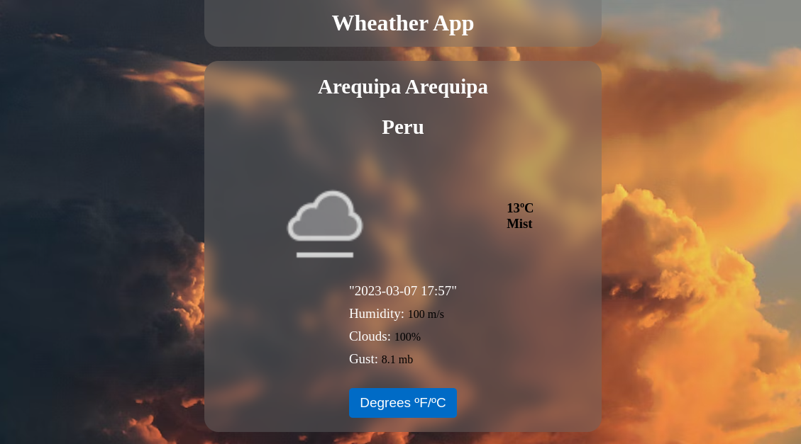

# Weather App

    

 

## Descripción

Utilice la API gratuita de [Open Weather App](https://openweathermap.org), usando el método getCurretPosition() obtuve las coordenadas del usuario. Usando las coordenadas obtenidas las utilicé en la API para obtener la información necesaria.

Desarrolle una aplicación que muestre datos del clima, obteniendo de la API los siguientes datos: país, ciudad, icono que describa el clima, la temperatura en grados centígrados, y un botón que cambie la temperatura a grados Fahrenheit. 

## Funciones y datos del proyecto

- Los datos del clima dependen de la ubicación del usuario.
- Correcto despliegue de datos: país, ciudad, icono que describa el clima, temperatura en grados centígrados.
- Botón que cambia de grados centígrados a Fahrenheit y viceversa.
- Tiene una pantalla de carga.
- La petición HTTP está hecha desde un custom hook.

## Utilice

- ReactJs
- Javascript
- Css
- Html
- Axios
- Frame Motion

## Autor
** Diego Nieves **
* [LinkedIn](https://www.linkedin.com/in/diego-nieves-04b409242/)
* [Portafolio web](https://nvs-portfolio.netlify.app)

## Abrir App
- [Wheater App](https://incandescent-cannoli-66ab91.netlify.app/)

## Contactame

Si quieres contactarme puedes escribirme a nieves.diego0426@gmail.com 👍.

  

    

